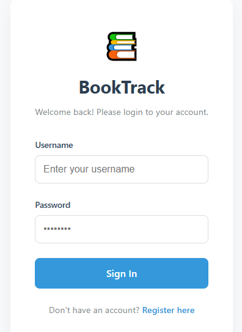
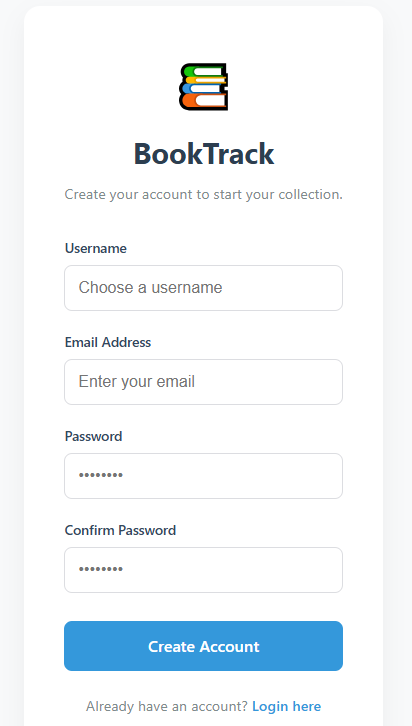
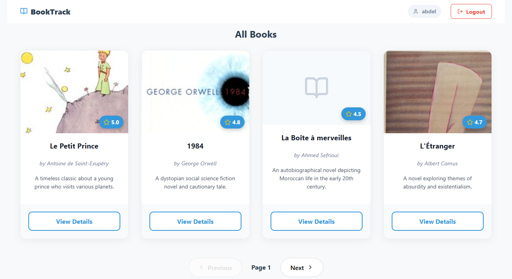
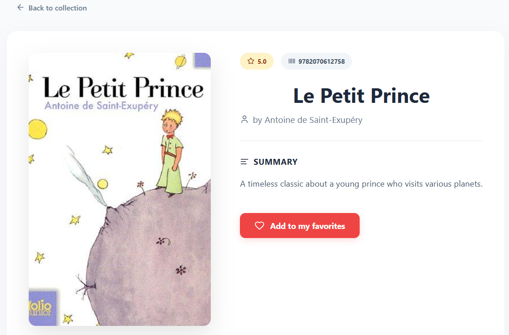

# 📚 BookTrack - Frontend

**BookTrack** est une application web de gestion de bibliothèque personnelle développée avec **Vue.js 3** et **TypeScript**. Elle offre une interface fluide et réactive pour explorer une collection de livres, gérer ses favoris et consulter des informations détaillées.

---

## Aperçu de l'Interface

### Authentification
Le tunnel d'entrée propose une expérience utilisateur cohérente avec des formulaires de connexion et d'inscription sécurisés.

### Login Page          



### Register Page       



### Accueil & Recherche

L'interface principale permet une recherche dynamique et une navigation par pagination.



### Détails & Favoris



---

## Stack Technique

* **Framework** : Vue.js 3 (Composition API)
* **Langage** : TypeScript 
* **State Management** : Pinia (Stores pour Auth, Books et Favorites)
* **Routing** : Vue Router
* **Tooling** : Vite 
* **Icons** : Iconify

---

## Architecture du Projet

```text
src/
├── api/          # Configuration Axios et intercepteurs
├── components/   # Composants réutilisables (BookCard, etc.)
├── router/       # Configuration des routes dynamiques
├── stores/       # Gestion d'état global avec Pinia
├── types/        # Interfaces et DTO TypeScript
└── views/        # Pages principales (Home, Details, Auth)
